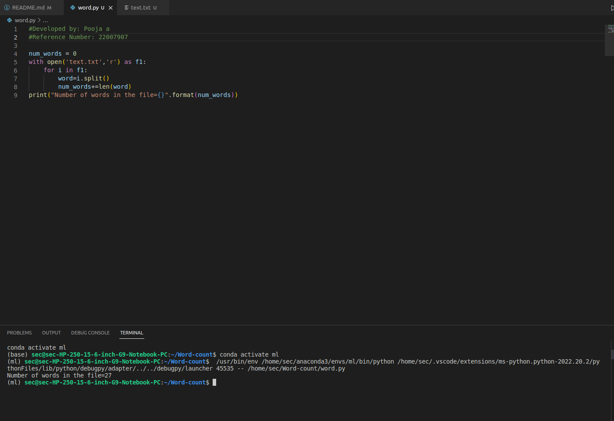
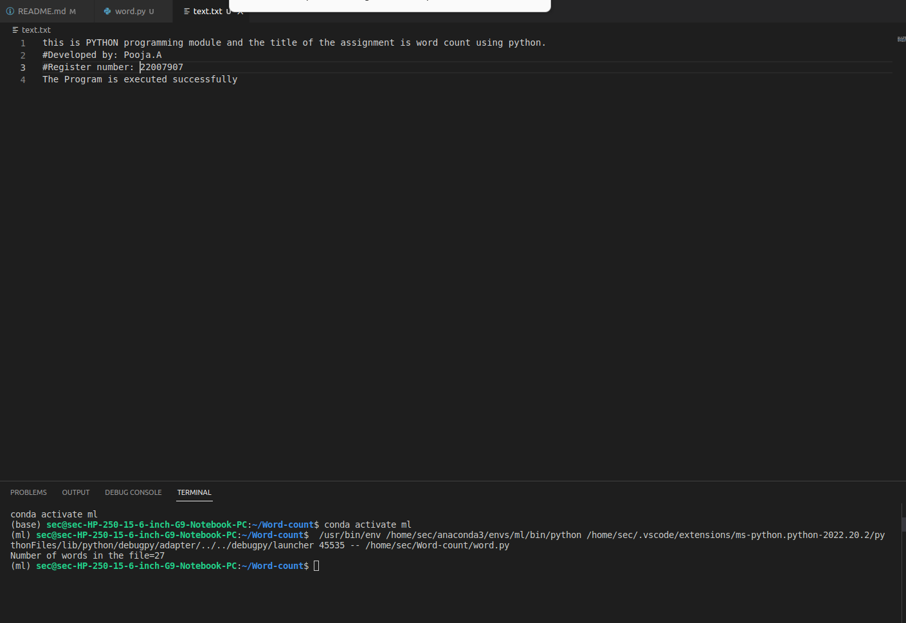

# Word-count
## AIM:
To write a python program for getting the word count from a text.
## EQUIPEMENT'S REQUIRED: 
PC Anaconda - Python 3.7

## ALGORITHM:
# Step 1:
Create a new text file and add comment

# Step 2:
Create a python file and add program

# Step 3:
Open the text file

# Step 4:
Using for loop find the length of words

# Step 5:
Print the number of words

# Step 6:
End the program

## PROGRAM:
```
#Developed by: Pooja A
#Reference Number: 22007907

num_words = 0
with open('text.txt','r') as f1:
    for i in f1:
        word=i.split()
        num_words+=len(word)
print("Number of words in the file={}".format(num_words))
```

### OUTPUT:



## RESULT:
Thus the program is written to find the word count from a text.
